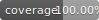

# What is this?




Sample Python project setup with minimal requirements

## Requirements

- [Poetry](https://github.com/python-poetry/poetry) -> Package and dependecy manager
- [Minicoda](https://docs.conda.io/en/latest/miniconda.html) -> (Optional) Useful to manage py version

## How to run?

```shell
make setup
```
